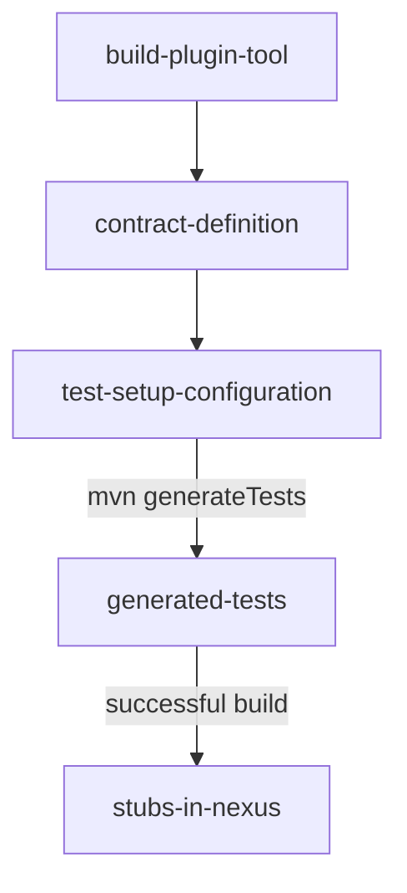

# Contract based Testing

Contract testing is a methodology for ensuring that two separate systems (such as two microservices) are compatible and can communicate with one other. It captures the interactions that are exchanged between each service, storing them in a contract, which then can be used to verify that both parties adhere to it.

This project, AKA: Activities for Kids and Adults, uses Spring Cloud Contract (SCC)/PACT for implementing the contract based testing. This guide provides an introduction to the use of Spring Contract Cloud.

The following diagram describes the required steps for setting up the Spring Cloud Contract.



Following the steps to set up the contract test in AKA platform:

1. Setup plugin in Producer side (payment-service)

```xml
<plugin>
    <groupId>org.springframework.cloud</groupId>
    <artifactId>spring-cloud-contract-maven-plugin</artifactId>
    <version>4.1.2</version>
    <extensions>true</extensions>
    <configuration>
        <testFramework>JUNIT5</testFramework>
        <baseClassForTests>org.oka.aka.paymentservice.contracttest.SccBaseContractTest</baseClassForTests>
        <failOnNoContracts>false</failOnNoContracts>
    </configuration>
</plugin>
```

Notice the definition of the base class: ```org.oka.aka.paymentservice.contracttest.SccBaseContractTest```

2. Setup the base class. 

The generated classes from the contracts need to extend from a base class. Following the base class defined:


```java
@SpringBootTest(webEnvironment = SpringBootTest.WebEnvironment.NONE, classes = {PaymentServiceApplication.class, SccBaseContractTest.TestConfig.class})
@AutoConfigureTestDatabase(replace = AutoConfigureTestDatabase.Replace.NONE)
@Testcontainers
@AutoConfigureMessageVerifier
@DirtiesContext
public class SccBaseContractTest {
    //
    @Container
    @ServiceConnection
    static KafkaContainer KAFKA = new KafkaContainer(DockerImageName.parse("confluentinc/cp-kafka:latest")).withReuse(true);
    @Container
    @ServiceConnection
    static PostgreSQLContainer<?> DB = new PostgreSQLContainer<>("postgres:16-alpine").withReuse(true);

    @DynamicPropertySource
    static void overrideProperties(DynamicPropertyRegistry registry) {
        registry.add("spring.kafka.bootstrap-servers", KAFKA::getBootstrapServers);
    }

    public void bookPayment() {

        Payment booked = builder().id(33).status("BOOKED").build();
        paymentService.sendPayment(booked);
    }

    static class KafkaMessageVerifier implements MessageVerifierReceiver<Message<?>> {
        private static final Log LOG = LogFactory.getLog(KafkaMessageVerifier.class);

        Map<String, BlockingQueue<Message<?>>> broker = new ConcurrentHashMap<>();


        @Override
        public Message receive(String destination, long timeout, TimeUnit timeUnit, @Nullable YamlContract contract) {
            broker.putIfAbsent(destination, new ArrayBlockingQueue<>(1));
            BlockingQueue<Message<?>> messageQueue = broker.get(destination);
            Message<?> message;
            try {
                message = messageQueue.poll(timeout, timeUnit);
            } catch (InterruptedException e) {
                throw new RuntimeException(e);
            }
            if (message != null) {
                LOG.info("Removed a message from a topic [" + destination + "]");
                LOG.info(message.getPayload().toString());
            }
            return message;
        }


        @KafkaListener(id = "orderContractTestListener", topics = {"payments"})
        public void listen(ConsumerRecord payload, @Header(KafkaHeaders.RECEIVED_TOPIC) String topic) {
            LOG.info("Got a message from a topic [" + topic + "]");
            Map<String, Object> headers = new HashMap<>();
            new DefaultKafkaHeaderMapper().toHeaders(payload.headers(), headers);
            broker.putIfAbsent(topic, new ArrayBlockingQueue<>(1));
            BlockingQueue<Message<?>> messageQueue = broker.get(topic);
            messageQueue.add(MessageBuilder.createMessage(payload.value(), new MessageHeaders(headers)));
        }

        @Override
        public Message receive(String destination, YamlContract contract) {
            return receive(destination, 15, TimeUnit.SECONDS, contract);
        }
    }
}
```

Notice how testcontainers are nicely integrated to use a real KAFKA broker and a real PostgreSQL DB.

3. Contract definition

The next step is to define the contract, as an agreement between ```payment-service``` (producer) and ```oder-service``` (consumer) and place it in the path: ```/test/resources/contracts/orderservice```

```groovy
Contract.make {
name("shouldCreatePayment")

    request {
        method 'POST'
        url '/api/paymentservice/payments'
        body([
                "amount"    : 15,
                "currency"  : "CHF",
                "type"      : "CREDIT_CARD",
                "cardNumber": "1234567890123"
        ])
        headers {
            contentType('application/json')
        }
    }

    response {
        status OK()
        body([
                "id"        : $(positiveInt()),
                "amount"    : 15,
                "currency"  : "CHF",
                "type"      : "CREDIT_CARD",
                "cardNumber": "1234567890123",
                "status"    : "CREATED"
        ])
        headers {
            contentType('application/json')
        }
    }
}
```

4. Run the build

Once the contract is defined, we can run the build to generate and run the tests:

```$ mvn verify```

Notice how a new set of test have been created in the folder: ```target/generated-test-sources```

To publish (in the context of this guide, **locally**) those contracts (in case that the implementation is successful) we need to run the following command:

```$ mvn install```

This will generate the stubs and install them in the LOCAL repository.

5.- Use the stubs on the consumer side: ```order-service```

We have to create a new integration test using the annotation:

```java
@AutoConfigureStubRunner(ids = {"org.oka.aka:paymentservice:+:stubs:6565"}, stubsMode = StubRunnerProperties.StubsMode.LOCAL)
```

Notice how the stubs are defined by the ids: ```org.oka.aka:paymentservice``` to be run in the port 6565. (This port can be defined to be randomized)

Following the test:

```java
package org.oka.aka.orderservice.client;

@SpringBootTest(classes = PaymentClient.class)
@AutoConfigureStubRunner(ids = {"org.oka.aka:paymentservice:+:stubs:6565"}, stubsMode = StubRunnerProperties.StubsMode.LOCAL)
@ContextConfiguration(classes = PaymentClientTestConfig.class)
public class PaymentClient_WithSCC_Test {
    @Autowired
    PaymentClient paymentClient;

    @Test
    void shouldReturnPaymentId() {
        // Given

        // When
        int id = paymentClient.createPayment(BigInteger.valueOf(15), "CHF", "CREDIT_CARD", "1234567890123");

        // Then
        assertThat(id).isGreaterThan(0);
    }

    @Configuration
    public static class PaymentClientTestConfig {
        @Bean
        RestTemplate restTemplate() {
            return new RestTemplateBuilder().rootUri("http://localhost:6565").build();
        }
    }
}
```

Notice how an ambient wiremock will impersonate ```payment-service``` during the text execution with the stubs generated from the contract definition. 