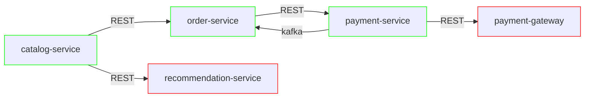

# AKA: Activities for Kids and Adults

AKA is a playground project that provides a platform to manage a catalog of Activities for Kids and Adults. It includes a catalog, order and payment service.

This project is used as a playground to learn and gain experience with different topics: contract testing (SCC/PACT), test-containers, spring-docker-compose, and the list is growing. 

## Requirements:
- Java 22
- Rancher Desktop
- Maven 3.2.5

# Start using the application

Move inside each service and read the README.md file

# AKA Platform diagram

Notice that not all the services are yet implemented. It is a work in progress

# Topics

## Contract Testing

The distributed service based design of the AKA platform makes it a good playground to experiment with Contract Testing. To get more insights, please have a look to [CONTRACT_TESTING.md](CONTRACT_TESTING.md)